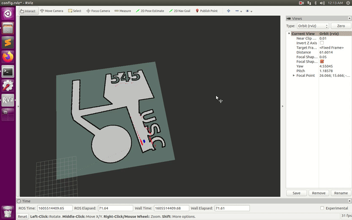

# Monte Carlo Localization

*NOTE: MORE SPECIFIC DESCRIPTION WILL BE UPLOADED LATER.*

This project includes an implementation of the Monte Carlo Localizer based on the particle filter for a mobile robot with a planar LIDAR range sensor. Using this sensory information and integrating it over time, it gains an accurate probabilistic understanding of where the robot is relative to the map.

The implementation is stored in *./code/catkin_ws/src/usc545mcl/bin/usc545mcl.py*.

 

 ### To Execute

To execute the code first build with catkin:
'''shell
sudo ./setup.sh
cd catkin ws
catkin build
'''

Then you can run the code:
'''python
source devel/setup.bash
roslaunch usc545mcl usc545mcl.launch
'''
